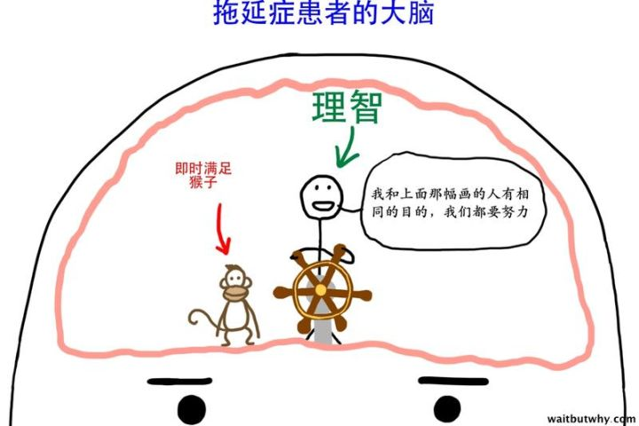

# 如何改变即时满足感的依赖？

本文的回答是基于文章 [人为什么会拖延](https://www.zhihu.com/question/20357585/answer/39760063)，如果没有读过的话，建议回头仔细读一下。

其核心的观点是，拖延症患者的大脑都有一只“即时满足的猴子”。

这只猴子很容易响应各种刺激，抢夺大脑的控制权：

事实上，这只猴子确实存在，它就是多巴胺系统 （参见我的另一篇文章：[1.6 盲兽多巴胺](1.6.md)）

当人接受某些刺激之后，就会分泌多巴胺，造成对快感的预期，这种预期就会驱使人做即时满足的行动。

即时满足的坏处在于，人们总能找到比 计划任务 更刺激的事情去做，取之不尽的“即时满足”会蚕食我们所有的精力和时间。

那么，怎么打败这只猴子呢？

- 在价值观上明白，“即时满足”不过是**透支未来的快乐**，并不能创造快乐。
- 把每一次的选择都当成最后一次机会，拒绝透支未来。详见我的文章：[1.1 年轻人如何在独居时有效地保持自律？](section1.1.md)
- 给任务增加截至日期。Deadline 是 即时满足 的最佳杀手。
- 记录下所有想去做的事情，给自己创造一个缓存区。在做完当前的正事之后，才开始 即时满足。
- 刻意的锻炼非即使满足的生活习惯。坚持一段时间，收益一辈子。（想想棉花糖实验）

