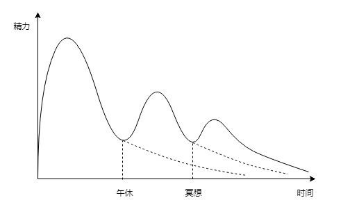
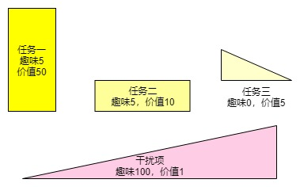

# 年轻人如何在独居时有效地保持自律？

我有三段比较自律的时间，第一段是高三准备高考时，第二段是边工作边准备考研时，第三段是现在，独居西欧。

高三的自律让我考上了985，考研的自律让我转专业到计算机（985），这两段时间的自律水平 都比不上我目前的自律。原因在于，高三时的自律，建立在良好的学习环境上；考研的自律，建立在明确的目标和Deadline之上。只有当前的自律，是无依无靠的自律，不勉而中的自律。

只有当潮水退去，才知道谁在裸泳。只有独居时，才知道谁有发自内心的自律。

那么我是怎么一点一点建立稳定的自律的呢？

## 重视环境

恐龙之所以灭绝，不是因为他们不强悍，而是因为他们不适应环境。

诺基亚手机之所以衰败，不是因为工艺水平差，也是因为没有适应环境的变化。

“物竞天择，适者生存。”这是个普世真理。

“具体问题具体分析”是马克思主义活的灵魂，“实事求是”是毛泽东思想活的灵魂。两者都强调**策略要因时因势而变**。

两位近当代最伟大的思想家，其思想核心都着眼在“适者生存”四字之上。

可见环境对人类、对社会、对修身处世的影响之巨大，适应环境就显得格外重要。

学校不同于宿舍，实验室不同于卧室。

在明亮的教室，有老师的监督、同学的榜样、还有印入眼帘的书籍，人进行学习的难度小很多。相应的，在昏朦的卧室，自已孑然一身，电脑、手机触手可及，一些娱乐放松、及时行乐的相法应运而生，学习的难度就大了。

在学校有老师的监督和同学的观察，还有学习的环境。当人偏离学习太远，不仅自己内心会忐忑，别人也会提醒。人在这样的环境中学习，就像行驶在有护拦的高速公路上。

在卧室没有任何的帮助和提醒，有的是娱乐和诱惑。人一旦走偏，就会越走越偏，直到精疲力尽。人在这样的环境中学习，**就像行驶在没有护拦的高速公路上**，一旦越界，就很难重从回轨道。

独居给自律最大的挑战就在于**没有护拦，没有纠偏，没有反馈。**

正常情况下，人希望的状态是，学习->学习->娱乐->学习->学习。。。

而事实上，在没有护拦的环境下，“学习->娱乐”常常发生，“娱乐->学习”不会发生。

这导致，人真实的状态是，学习->学习->娱乐->娱乐->娱乐。。。

因此我给周末定的计划是：自起床始，不做任何娱乐的事情（也包括知乎，会让自己分心），直到中午。

这样，我的周末上午都是充实的。

当然最理想的情况是所有的学习任务完成之后才开始娱乐，在此之前只有“学习”与“休息”两个选项。

## 标本兼治

正是因为策略要因时因势而变，人就应该采用标本兼治的工作方法。

很多时候，我们认为解决意志力的问题，关键在于解决思想上障碍，也就是治本。解决了思想上的障碍，其他困难也迎刃而解。

其实，任何问题的产生都是思想与环境想结合的产物。单单解放思想，不注重具体方法与步骤，就会导致大跃进式的失败。而具体的方法和步骤只能在分析环境、分析具体问题之后给出。

任何问题的解决都需要标本兼治。只治标：问题没有根本解决。只治本：系统阻力过大，不稳定性增加，治本之策无法有效落实。

标本兼治，即可解燃眉之急，又可根除隐患。

在学习过程中，分析自己大量的时间都流到哪里去了，找出自己的时间黑洞，找出学习中的所有干扰项和诱惑物，针对性地曲突徙薪，能立刻改善当前的症状，增强自身信心。

比如，我在吃晚饭的时间喜欢看游戏直播，导致吃完饭之后大量时间浪费。

我就用一些不易上瘾的视频替代，并且在晚饭之后冥想，以充分利用晚饭之后的时间。

以上二条都是抽象的思考，第一条主要用于分析形势，第二条是解决问题的方法论。两者珠联璧合，相得益彰，可以用于分析和解决人生中的一切问题，

接下来我将就自律过程中的细节，具体问题具体分析。

## 精力管理

人每天的精力不是均等分布的，而是波浪型分布。如图，起床清醒后，精力会迅速攀升，在上午达到高峰，然后随时间幂指式递减。

午休和冥想都会清理大脑进程，清空缓存，和睡眠一样，会恢复大脑一定精力，提升一天的精力总值。

而精力管理的目标并不是单单提升精力，而是充分利用精力和时间做最有价值的事情。

&emsp;&emsp;*宽度代表时间；高度代表精力*

如上图所示，精力管理的目标是：在精力曲线与时间围成的区间内，填充总价值量最多的任务块。

其中：

* 任务一：开拓创新型任务。精力消耗量大（高度很高），持续时间有限，价值很高。
* 任务二：维护型任务。精力消耗量低（高度低），持续时间长，价值一般。
* 任务三：一般事情。精力消耗量低（高度底），持续时间短，价值较低。
* 干扰项：趣事。即粉色区块，需单独说明。 
趣事有很强的趣味性，也会提供一定的价值，就像看视频、微博、微信、知乎一样，提供大量的趣味 和 零散的信息和知识。它们刚开始时消耗精力极少，用户粘性强，持续时间长，后期消耗精力大。

为什么趣事的持续时间长？

一方面快感也会消耗精力的，另一方面由于价值供应不足，人就会因为价值的缺失而产生焦虑，消耗精力。最后，人为了填充价值的缺失，就会增加趣事的摄入量，导致消耗更多时间。

根据精力曲线的形状和任务的特点，人最佳的方案是：在上午时完成任务一，中午是完成任务二，晚上完成任务三。

我的日常计划是：

上午：完成最重要、最有挑战性的开拓型任务。

下午：完成持续性、维护性、一般性任务。

晚上：完成机械型、重复型任务，或单纯信息摄入型任务，比如听听讲座，看学习视频等。

同时，根据干扰项的特点，人要尽量推迟插入干扰项的时间，因为它们持续时间长，消耗大量精力，导致其余任务很难完成。

另外根据边际效用递减法则，娱乐会在刚开始时产生大量快感，后期也会变得枯燥。人沉迷其中，主要是因为惯性。

因此最具性价比的休闲方式是推迟娱乐的开始时间，控制娱乐的结束时间。设定边界是极好的方法。

我一般允许自己在晚上开始娱乐，不超过一个半小时。

## 睡眠

人一天的精力曲线与前一天的睡眠状态息息相关。前一天睡眠不好，既影响精力，又影响自信，是自律的第一大敌。

人在入眠之时，恰恰是一天之中精力水平最差的时候，很容易管不住自己，导致熬夜娱乐。因此睡眠很容易被 不自律 影响。

可以说，规律的睡眼是自律的基础和关键。

那么人为什么会熬夜呢？

当人躺在床上，放下手机（平板）准备睡觉，会发现一些通知没有回复，于是点开微信……今日事今日毕，理所应当。

处理的过程中发现朋友圈应该有新内容，扫一眼也不费多少时间。此时大脑微微兴奋。

扫完发现讨论群、公众号里有一些有趣的消息，再看一眼也无大碍。此时大脑比较兴奋。

处理完微信，想起来知乎。打开知乎，被知乎话题吸引，大脑清醒如白昼。

处理完知乎，发现今天还没刷抖音，哔哩呢。

……

于是计划11点睡觉，拖到了2点，甚至有点失眠。

关于睡眠，我有以下几点经验。

- 白天多做有意义的事情，意义感的缺失会让人有睡眠的罪恶感。
- 晚上冥想后就洗漱（大约8点左右）。目的是让11点的时候自己能倒头就睡，入睡没有阻碍。
- 手机调到飞行模式。睡眠时的手机异响可能直接惊醒自己，也有可能让自己从深睡眠跳到浅睡眠。人在浅睡眠中就容易多梦，导致疲惫。
- 躺下后，不再接触开放信息源。微信、知乎、微博、B站都是开放信息源，新鲜内容源源不绝，一开始就停不下来。
- 11点准时休息。
- 发现自己做梦就顺手打开窗帘。因为做梦表明自己处于浅睡眠中，是最佳的起床时机。打开窗帘有助于接收阳光，抑制褪黑素。
- 听听音乐，伸伸懒腰就可以起床了。

## 远离诱惑

请记住，诱惑是环境与脑回路共同作用的结果。它是客观的，不是主观的。

很多人常常以为诱惑可以靠观念的转变解决，或者靠自制力解决。

太Naive了，诱惑是一种客观的存在，客观的存在对主观的愿望常常是降维打击，就像三体水滴碾压宇宙舰队一样。丁仪面对水滴时说的最后一句话是，“傻孩子们，快跑啊。”

我曾经对游戏上瘾，其客观原因在于两点，一是国外的生活枯燥和压抑，不能提供足够的满足感。二是，上瘾已经形成了回路，这个奖惩回路很强健。

如果我的生活状态不发生明显的改变，上瘾的状态就不会改变。

明白了这点，我放弃了通过主观努力克服上瘾的想法，只有远离诱惑一条路可走。正是断了“克服上瘾”的念想，我之后再也没有打过游戏。

## 拖延的本质是透支

人通过透支未来的时间、精力、可能性，在当下获得加倍的快乐。比如，周末本来是休息、缓冲、储能的时间，但大多数人在周末会选择透支，结果周一更加疲惫。

**拖延的每一天都很容易，可一年一年越来越难**。自律的每一天都不轻松，可一年一年越来越轻松。

举个例子，当我们在犹豫选择背单词，还是刷B站时，我们下意识地看了一下时间，还有四小时呢，时间绰绰有余。于是我们先刷B站，不知不觉两个小时过去了。随后我们想起要背单词的，但是大脑已经是被惯坏的猴子，不可能静下心来学习。我们想明天还有时间，只要明天用功，今天的单词是可以补回来的了……

明代诗人钱福，有感人于透支未来的害处，说“明日复明日，明日何其多，我生待明日，万事成蹉跎。”。他自己则连中二元，分别是会元和状元，成为拒绝透支未来的典范。

如何拒绝透支未来呢？我有一个思维工具可以分享给大家。

【把每一次的选择都当成最后一次机会。】

在背单词的例子中，原来的选项是：A、 背单词，B、 刷B站， C、 现在刷B站，未来背单词。
于是人很自然选择了C。

这一思维工具有效地剔除C选项，在A、B中二选一时，很多人是能够做出理性的选择的。于是人会选择先背单词，然后娱乐。

与此相仿，美国作家Og. Madino提出另一个经典的思维工具，“假如今天是我生命中的最后一天”，把每一天当成最后一天自然不太可能透支未来。

Madino的思维技巧对一部分人可能十分有用，对我来说作用力有限。因为我的大脑会慢慢明白“今天是我生命中的最后一天”的可能性极低。

在我的思维工具中，“当前的选择是最后一次的选择”的概率是很高的。比如，当前选择放纵，很可能就放纵一天，C选项（未来选项）很少发生。因此，我的这个思维工具是符合事实和规律的，经个人实践也是稳定有效的。

任何时候，我们寄希望于未来的时间、精力、金钱和机会，都是在透支，未来被透支得越多，未来的负担越大，未来的天空越阴霾，未来的自己越羸弱。

## 如何克服即时满足

即时满足（Instant Gratification）是人的本能。人为了当下的满足作出最迅速的反应，这在漫长的进化史中，是人类的始祖们必不可少的求生技能。他们在复杂多变的丛林中稍有犹豫，可能就见不到明天的太阳。

人类进入信息化社会之后，铺天盖地的广告、营销、资讯、视频，不断地刺激着人的兴奋点，如果人类仍然屈从于即时满足，必然晕头转向，一事无成。悲守穷庐，将复何及。

即时满足是脑海中稳定的回路，它的电阻小，很容易激活，一旦激活之后，就在大脑中行成短路，将理性思考旁路掉。人看到朋友圈的小红点、知乎的通知，就一定马上要去点，一旦开始就投入不少时间。

那么如何克服即时满足呢？

先了解一个至关重要的概念——损失厌恶（Loss aversion）。顾名思义，大脑像个很贪的小孩，一直在说“ 我全都要。”

大脑对损失更加敏感，不能忍受，它会本能地优先处理那些“可能快速逝去”事情，然后再做十拿九稳的事情。这就是为什么有时候人们在做正事之前，总是先做很多细枝末节的事情。大脑太贪了。

处理这一现象的绝佳方法之一，“五分钟冷静法”（Five-minutes cool-down），把冲动先搁置五分钟，五分钟的冷静时间足以过滤掉大多数无益的冲动。为了配合这一方法，可以把冲动都记录下来，大脑就不会焦虑了。将冲动从大脑内存转到硬盘，可以节省大脑资源，来处理其他事情。

总结一下其他重要方法：

- 慎始。上文提到，即时满足一旦激活，就会稳定的导通回路，会旁路掉理性，很难处理。防患于未燃始终是最经济安全省事的策略，而且会大大地节省大脑的内存。
- 分辨。人的需要分为生理需要和普通欲望。生理需要是需要尽量满足的，而欲望并不需要。分辨这点，有助于给大脑降低焦虑和恐慌。
- 五分钟冷静法。见上文。

## 学不进去时怎么办

人有一种行动偏误，就是在不知所措的时候，总是要做些什么才能安心。

比如有人在投资股票时，看到股价波动，总是要操作一下，要么追加，要么抛出，结果自然是亏本。

为了应对行动偏误，人最优的策略是，在情况不明时按兵不动，直到分析清形势。

学不进去时，表明大脑判断自己没有能量支持后面的学习，最优的策略就是休息储能，然后再战。

休息储能，可以使用假寐，冥想，做眼保健操，深呼吸等等，总之让大脑放空，安静下来，持续一断时间。

等能量恢复到安全线以上，就可以继续之前的学习了。

为什么要继续之前的学习？

因为大脑对一门学科进行高强度的集中突破，是最高效的学习方法之一。

如果遇到难处就中断学习，大脑就自动为此门学科贴上“困难”的标签，你就不可能爱上这门学课了。

**把当前的难点跨过去，你就驯服了它，否则它就驯服了你。**

## 最强有力的武器是状态

自律的目标不是一段时间内有爆棚的生产力，而是维持一个状态——

**每晚都心满意足地躺下，清晨都满怀期待地睁眼。**

当人处于这样的状态中时，时间本身像裹了糖一样，这就是天底下最幸福的生活生式。

有这种生活状态的人，就算遭受一定的命运重击，仍然能恢复到自己本来的位置。这样的状态既是坚韧的铠甲，也是锋利的武器。

所以追求自律的过程中，大可不必因为一两次失败而沮丧，因为你的目标不是一城一池，而是一个状态。

也不要太过分透支精力，不要熬夜学习，因为你的目标不是一城一池，而是一个状态。

一个保有余力的生活状态。

