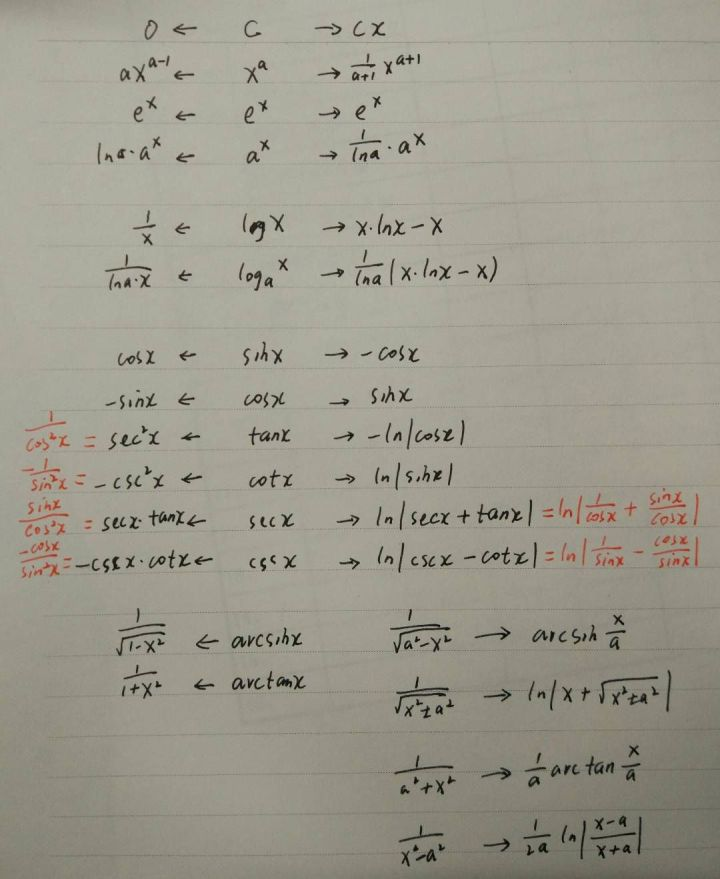

# 考研数学怎么学?

17年数二，144分，985高校录取，现在西欧留学中。

笔者当时边工作边考研，学习时间只有应届学生的一半左右，外加跨专业考研，取得上述成绩还是令人欣慰的。

那么数学有诀窍吗？诀窍在哪儿？

我感觉是有的，不然我的效率也不会那么高。

## 一

上图就是我的高数秘笈——微积分大一统表。

将高数融于一炉，千锤百炼得到此精华公式。向左求导，向右积分，既保留了联系，又对比了区别。

“微积分大一统表”诞生的哪一刹那，我颇为自信地对自己说，“数学，稳了”。

## 二

越是使用频次高的东西，越值得打磨到极致。

此表包含全本高数中使用频率最高的所有公式，经过高度整合，可谓智慧与美感其飞，精简共极致一色。

我在备考后期每天早晚默写一篇此表，持续了一个月以上。

把它背得像“九九乘法表”一样纯熟，“大一统表”就像思维烙印一样融化在我的血液里。

于是我更加自信，“有龙血加持，我会输？”

## 三

我分别用1倍速，和1.5倍速听了张宇的数学精讲（视频）。

由于我是工作之后考研，掌握知识点不完整，所以我先用1倍速听完精讲，补全知识图谱。再用1.5倍速听，融汇贯通。

## 四

做真题。

学游泳就一定要下水，备考试就一定要做题。

我刚把约20套真题做了一遍，还来不急反刍和吸收，就到了考试日。

如果再给我多一点点时间，考150分还是很有可能的，那样就可以好好吹一波了。

看到其他答案中高耸的学习教材和笔记，我感觉以上方法绝对是最经济、最实用、最高效的备考数学的方法，就算只剩一个月时间，仍然可以大幅提高成绩。